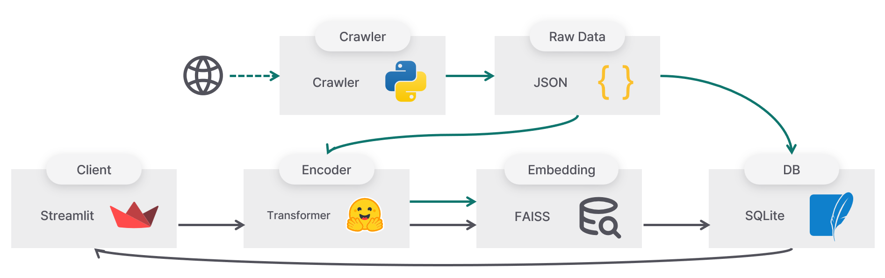

# 🐕 스꾸 리트리버

학교 공지사항 검색 챗봇.

SKKU Retriever: School Notice Search Chatbot.

<video src="https://private-user-images.githubusercontent.com/75429815/426141817-a7f7a292-75cb-4493-8411-5ded8fa783e9.mp4?jwt=eyJhbGciOiJIUzI1NiIsInR5cCI6IkpXVCJ9.eyJpc3MiOiJnaXRodWIuY29tIiwiYXVkIjoicmF3LmdpdGh1YnVzZXJjb250ZW50LmNvbSIsImtleSI6ImtleTUiLCJleHAiOjE3NDI4Mjk1NTMsIm5iZiI6MTc0MjgyOTI1MywicGF0aCI6Ii83NTQyOTgxNS80MjYxNDE4MTctYTdmN2EyOTItNzVjYi00NDkzLTg0MTEtNWRlZDhmYTc4M2U5Lm1wND9YLUFtei1BbGdvcml0aG09QVdTNC1ITUFDLVNIQTI1NiZYLUFtei1DcmVkZW50aWFsPUFLSUFWQ09EWUxTQTUzUFFLNFpBJTJGMjAyNTAzMjQlMkZ1cy1lYXN0LTElMkZzMyUyRmF3czRfcmVxdWVzdCZYLUFtei1EYXRlPTIwMjUwMzI0VDE1MTQxM1omWC1BbXotRXhwaXJlcz0zMDAmWC1BbXotU2lnbmF0dXJlPWM1NDUwNjhkN2Y5OGM4YzYyOTg4OTY4YTI4M2U3Y2MwM2JlZGQ2Mjc1Zjc5ZTZkYWQ4NjY1OThmY2JiNGJmNmImWC1BbXotU2lnbmVkSGVhZGVycz1ob3N0In0.CGBG04rwF97fINcs_L1zKhzLsA45pMkkgkqND0mS4RM" controls muted></video>

```bash
$ pip install -r requirements.txt
$ huggingface-cli login
$ python config.py --token YOUR_OPENAI_TOKEN
$ streamlit run main.py
```

- Available notices: 23.11.03 ~ 25.03.13
- Blog: [한국어](https://denev6.github.io/projects/2025/03/24/retrieve-notice.html)

## Architecture



1. Crawl notices: [crawl.py](./utils/crawl.py)
2. Create database: [json2sqlite.py](./utils/json2sqlite.py)
3. Embed notices as vectors: [embed.py](./embed.py)
4. Retrieve and summarize: [retrieve.py](./retrieve.py)
5. Test in the browser: [main.py](./main.py)
